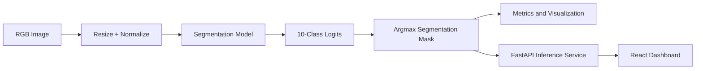
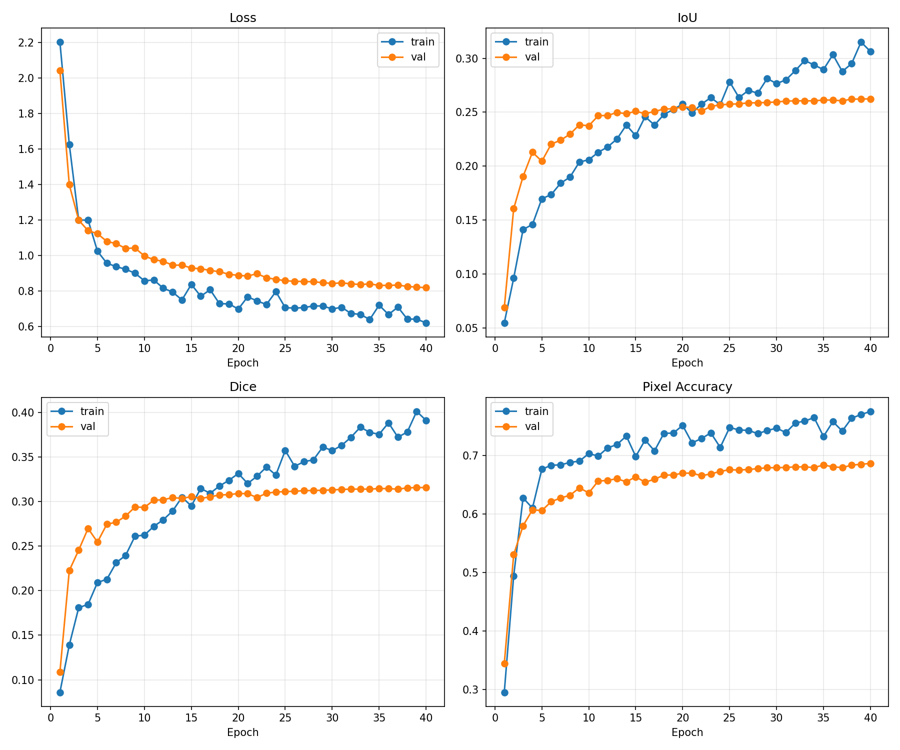
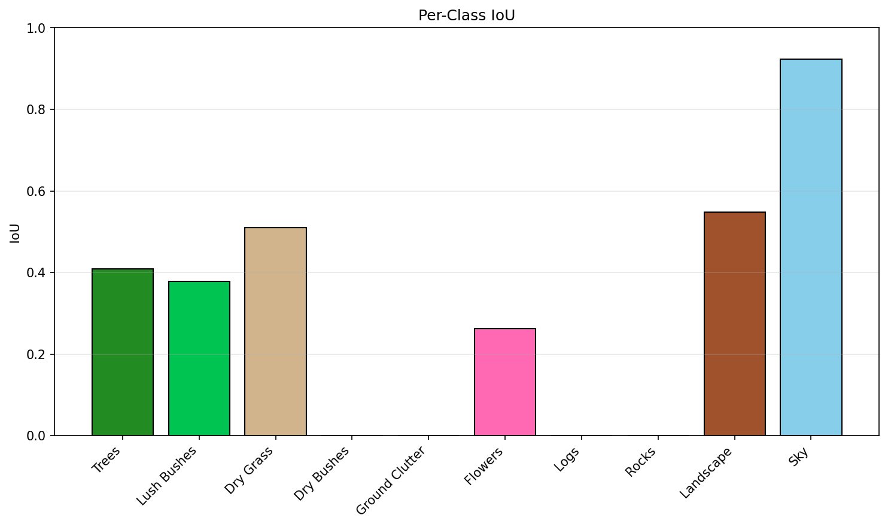
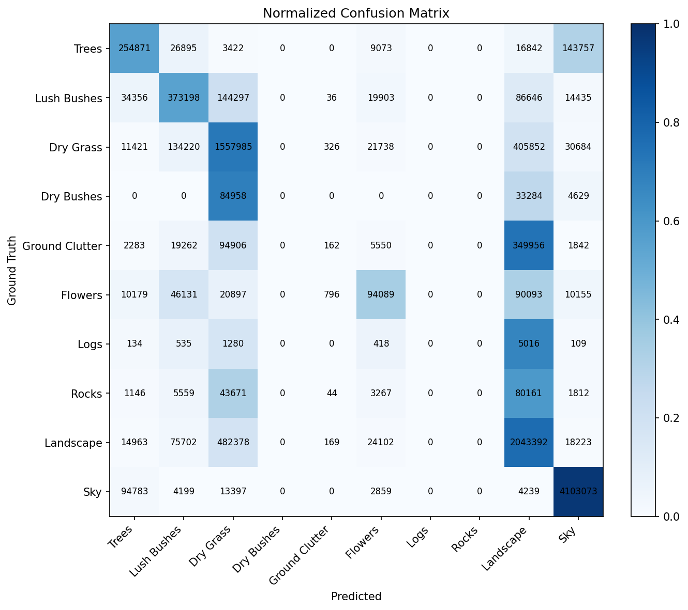
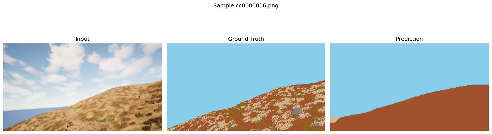
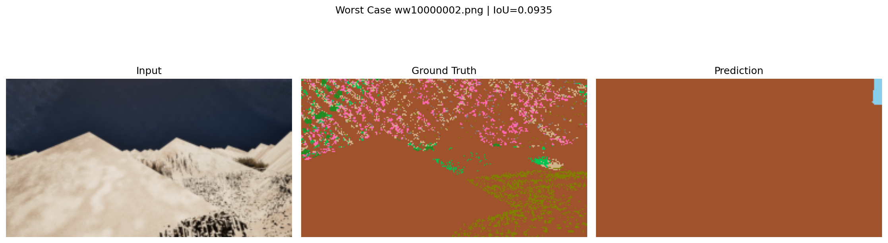
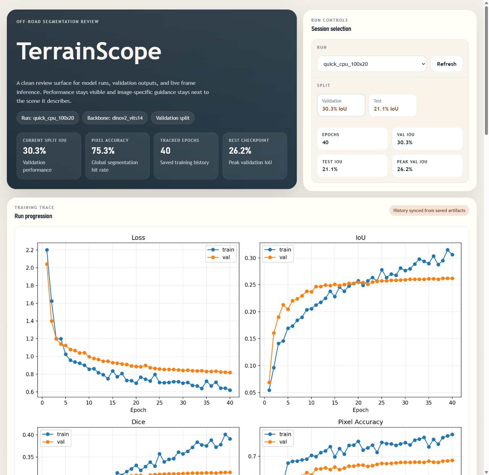

# TerrainScope: Off-Road Semantic Segmentation with DINOv2

> Team Invincible  
> Karna Bhosle, Alok Kushwaha, Shankar Gouda

TerrainScope is a complete off-road semantic segmentation pipeline built for the Duality AI off-road scene understanding task. The repository includes dataset handling, training, evaluation, visualization, a live inference API, and a React dashboard for qualitative comparison and model inspection.

The production code in this repository lives outside the legacy `offroad_ai_system` folder. That older folder is intentionally excluded from the active workflow.

## Problem Statement

Autonomous off-road navigation requires a model that can separate traversable terrain from visually similar obstacles such as bushes, logs, rocks, clutter, and background landscape. The goal of this project is to train a semantic segmentation system that can classify every pixel in an off-road image into one of ten terrain classes and expose the result through both reproducible scripts and an interactive web interface.

## Solution Overview

TerrainScope implements multiple state-of-the-art segmentation architectures for comprehensive off-road scene understanding. The system includes DINOv2 ViT-B/14, SegFormer B0, and DeepLabV3+ models, all trained on the Falcon dataset. The training and evaluation pipeline is config-driven, CPU-safe by default, and backed by a React + FastAPI demo layer for live inference and visual comparison.

### Key Capabilities

- 10-class off-road semantic segmentation with a fixed `uint16` Falcon mask contract
- Config-driven `train.py`, `test.py`, and `visualize.py` entrypoints
- Strict dataset validation to prevent silent label corruption
- Training and evaluation artifact export: checkpoints, metrics, plots, confusion matrix, prediction masks, comparisons, and worst cases
- FastAPI backend for run switching and image upload inference
- React dashboard for metrics, side-by-side comparison, fullscreen viewing, and image-level suggestions

## Final Results Snapshot

Two DINOv2 runs now matter in this repository:

- `quick_cpu_100x20`: the strongest test-generalizing CPU baseline
- `probe_continue_high_iou`: a warm-start continuation that improves validation IoU substantially, but currently overfits relative to the held-out test split

| Run | Purpose | Model | Validation IoU | Validation Dice | Validation Accuracy | Test IoU | Test Dice | Test Accuracy |
| --- | --- | --- | ---: | ---: | ---: | ---: | ---: | ---: |
| `quick_cpu_100x20` | Best balanced CPU baseline | DINOv2 ViT-S/14 + ConvNeXt-style head | 32.93% | 41.75% | 77.00% | **21.21%** | **26.34%** | **61.66%** |
| `probe_continue_high_iou` | Best validation-focused continuation | DINOv2 ViT-S/14 + ConvNeXt-style head | **42.88%** | **55.42%** | **78.38%** | 19.80% | 25.84% | 40.71% |

The continuation recipe raised full validation IoU by **9.95 percentage points** over the previous baseline, but it did **not** improve test-set generalization yet. If your priority is the highest validation IoU, use `probe_continue_high_iou`. If your priority is the stronger test result, keep `quick_cpu_100x20`.

Additional model support is now implemented for:
- `dinov2_vitb14`
- `segformer_b0`
- `deeplabv3plus`

Those alternate backbones have working train/eval/inference paths and short CPU smoke runs, but they have not yet surpassed the DINOv2 continuation result above on validation or the `quick_cpu_100x20` baseline on test.

## Dataset

### Download Link

- Google Drive dataset: <https://drive.google.com/drive/u/0/folders/1TEyTM514of7vPAC0evBV6IdgX9_v5PV3>

### Expected Folder Layout

```text
Offroad_Segmentation_Training_Dataset/
  Offroad_Segmentation_Training_Dataset/
    train/
      Color_Images/
      Segmentation/
    val/
      Color_Images/
      Segmentation/

Offroad_Segmentation_testImages/
  Offroad_Segmentation_testImages/
    Color_Images/
    Segmentation/
```

### Dataset Split Sizes

| Split | Images |
| --- | ---: |
| Train | 2857 |
| Validation | 317 |
| Test | 1002 |

### Label Contract

All masks are read as `uint16` and mapped through a shared canonical class contract.

| Raw Value | Class ID | Class Name |
| ---: | ---: | --- |
| 100 | 0 | Trees |
| 200 | 1 | Lush Bushes |
| 300 | 2 | Dry Grass |
| 500 | 3 | Dry Bushes |
| 550 | 4 | Ground Clutter |
| 600 | 5 | Flowers |
| 700 | 6 | Logs |
| 800 | 7 | Rocks |
| 7100 | 8 | Landscape |
| 10000 | 9 | Sky |

Unknown mask values are mapped to `255` and treated as invalid. This prevents silent background remapping and forces bad annotations to fail early.

## Architecture



### Model Components

| Component | Choice |
| --- | --- |
| Supported model types | `dinov2`, `segformer_b0`, `deeplabv3plus` |
| Default backbone | `dinov2_vits14` |
| Alternate DINOv2 backbone | `dinov2_vitb14` |
| SegFormer variant | `nvidia/segformer-b0-finetuned-ade-512-512` |
| DeepLabV3+ encoder | `mobilenet_v2` |
| Encoder mode | Frozen by default, optional full fine-tuning |
| Head | Lightweight custom head for DINOv2, native decoder for SegFormer / DeepLabV3+ |
| Input size for validated baseline | `140 x 252` |
| Default device | Auto-detect, CPU-safe by default |
| Losses | Cross-entropy or class-balanced CE + Dice |
| Optimizers | SGD or AdamW |

### Why This Design

- **DINOv2** provides a strong baseline even under CPU-constrained training.
- **Multiple model backends** make the project useful for both benchmarking and follow-up experimentation.
- **High-IoU training options** now include class-balanced loss, balanced sampling, augmentation, gradient accumulation, and cosine scheduling.
- **Shared dataset contract** eliminates label mismatches between training, evaluation, visualization, and live inference.
- **Separate API + frontend** makes the project easier to demo for judges and easier to reproduce for reviewers.

## Repository Structure

```text
.
+-- Offroad_Segmentation_Scripts/
�   +-- configs/
�   +-- ENV_SETUP/
�   +-- offroad_segmentation/
�   +-- train.py
�   +-- test.py
�   +-- visualize.py
�   +-- requirements.txt
+-- frontend/
�   +-- server/
�   +-- src/
�   +-- scripts/
+-- docs/
�   +-- screenshots/
+-- README.md
+-- report.md
+-- report.pdf
+-- project_documentation.txt
```

## Screenshots and Visual Evidence

### Training Curves

The validated baseline shows steady improvement across loss, IoU, Dice, and pixel accuracy over the resumed 80-epoch training history.



### Per-Class Validation IoU

This chart highlights which terrain categories the model handles well and which ones remain weak. Landscape and sky are strong; rare obstacle classes remain difficult.



### Validation Confusion Matrix

The confusion matrix shows that visually dominant classes are learned reasonably well, while rare or visually overlapping obstacle categories still confuse the model.



### Qualitative Comparison

Example validation output showing RGB input, ground truth, and model prediction side by side.



### Failure Case

Representative hard case from the exported worst-case set. This is useful for explaining where the model still struggles.



## Training and Evaluation Workflow

### 1. Install Dependencies

```powershell
python -m pip install -r .\Offroad_Segmentation_Scripts\requirements.txt
```

### 2. Run a Smoke Test

```powershell
python .\Offroad_Segmentation_Scripts\train.py --dry_run --max_train_batches 1 --max_val_batches 1 --run_name smoke_test
```

### 3. Train the validated baseline

```powershell
python .\Offroad_Segmentation_Scripts\train.py --config .\Offroad_Segmentation_Scripts\configs\quick_cpu.json --epochs 20 --max_train_batches 100 --max_val_batches 20 --run_name quick_cpu_100x20
```

### Fast model-switching commands

These configs keep training short on CPU by using frozen encoders, batch size `1`, and small image sizes.

```powershell
# DINOv2 ViT-B/14
python .\Offroad_Segmentation_Scripts\train.py --config .\Offroad_Segmentation_Scripts\configs\quick_cpu_dinov2_vitb14.json --max_train_batches 50 --max_val_batches 10 --run_name quick_dino_vitb14

# SegFormer-B0
python .\Offroad_Segmentation_Scripts\train.py --config .\Offroad_Segmentation_Scripts\configs\quick_cpu_segformer_b0.json --max_train_batches 50 --max_val_batches 10 --run_name quick_segformer_b0

# DeepLabV3+ with MobileNetV2
python .\Offroad_Segmentation_Scripts\train.py --config .\Offroad_Segmentation_Scripts\configs\quick_cpu_deeplabv3plus.json --max_train_batches 50 --max_val_batches 10 --run_name quick_deeplabv3plus
```

### 4. Resume the validated baseline to 80 epochs

```powershell
python .\Offroad_Segmentation_Scripts\train.py --config .\Offroad_Segmentation_Scripts\configs\quick_cpu.json --resume_from .\Offroad_Segmentation_Scripts\runs\quick_cpu_100x20\checkpoints\last.pth --epochs 40 --max_train_batches 100 --max_val_batches 20
```

### 5. Run the faster high-IoU continuation

This is the fastest validated improvement path we found on CPU. It warm-starts from the `quick_cpu_100x20` checkpoint, switches to class-balanced CE + Focal + Dice loss, uses stronger augmentation, and keeps training capped to stay practical.

```powershell
python .\Offroad_Segmentation_Scripts\train.py --config .\Offroad_Segmentation_Scripts\configs\high_iou_continue_from_quick.json --resume_from .\Offroad_Segmentation_Scripts\runs\quick_cpu_100x20\checkpoints\best_iou.pth --resume_weights_only --epochs 8 --max_train_batches 100 --max_val_batches 20 --run_name probe_continue_high_iou
```

Result from that exact continuation:
- Validation Mean IoU: `42.88%`
- Validation Mean Dice: `55.42%`
- Validation Pixel Accuracy: `78.38%`

### 6. Evaluate on Validation

```powershell
python .\Offroad_Segmentation_Scripts\test.py --config .\Offroad_Segmentation_Scripts\configs\quick_cpu.json --model_path .\Offroad_Segmentation_Scripts\runs\quick_cpu_100x20\checkpoints\best_iou.pth --data_root .\Offroad_Segmentation_Training_Dataset\Offroad_Segmentation_Training_Dataset\val
```

Validation for the continuation run:

```powershell
python .\Offroad_Segmentation_Scripts\test.py --config .\Offroad_Segmentation_Scripts\configs\high_iou_continue_from_quick.json --model_path .\Offroad_Segmentation_Scripts\runs\probe_continue_high_iou\checkpoints\best_iou.pth --data_root .\Offroad_Segmentation_Training_Dataset\Offroad_Segmentation_Training_Dataset\val --output_dir .\Offroad_Segmentation_Scripts\runs\probe_continue_high_iou\evaluations\val_full_epoch8
```

### 7. Evaluate on Test

```powershell
python .\Offroad_Segmentation_Scripts\test.py --config .\Offroad_Segmentation_Scripts\configs\quick_cpu.json --model_path .\Offroad_Segmentation_Scripts\runs\quick_cpu_100x20\checkpoints\best_iou.pth --data_root .\Offroad_Segmentation_testImages\Offroad_Segmentation_testImages
```

Test for the continuation run:

```powershell
python .\Offroad_Segmentation_Scripts\test.py --config .\Offroad_Segmentation_Scripts\configs\high_iou_continue_from_quick.json --model_path .\Offroad_Segmentation_Scripts\runs\probe_continue_high_iou\checkpoints\best_iou.pth --data_root .\Offroad_Segmentation_testImages\Offroad_Segmentation_testImages --output_dir .\Offroad_Segmentation_Scripts\runs\probe_continue_high_iou\evaluations\test_full_epoch8
```

### 7A. Train the stronger IoU-oriented recipe

This path is designed to push beyond the quick baseline. It enables class-balanced CE + Dice loss, balanced sampling, data augmentation, AdamW, cosine scheduling, and larger input resolution.

```powershell
python .\Offroad_Segmentation_Scripts\train.py --config .\Offroad_Segmentation_Scripts\configs\high_iou_segformer_b0.json
```

```powershell
python .\Offroad_Segmentation_Scripts\train.py --config .\Offroad_Segmentation_Scripts\configs\high_iou_dinov2.json
```

For this recipe, do not cap training with `--max_train_batches` if your goal is to chase `0.50+` IoU. The capped continuation above is the practical CPU compromise; the uncapped version is materially slower.

### 8. Colorize Raw or Predicted Masks

```powershell
python .\Offroad_Segmentation_Scripts\visualize.py --input_path .\Offroad_Segmentation_testImages\Offroad_Segmentation_testImages\Segmentation --mode raw
```

## Live Inference Dashboard

The repository also includes a demo layer for live image upload and run-aware inference.

### Frontend Dashboard Preview

This screenshot shows the tracked dashboard view used to review the final run, inspect metrics, and browse validation outputs.



### Start the API Server

```powershell
.\.venv\Scripts\uvicorn frontend.server.app:app --reload --port 8000
```

### Start the React Frontend

```powershell
cd .\frontend
npm install
npm run dev
```

### Frontend Features

- Run switching without manual re-export
- Validation/test comparison browsing
- Fullscreen compare modal
- Upload image inference with backend prediction
- Image metadata, confidence summary, dominant class, and terrain suggestions

## Output Artifacts

A completed run produces the following important outputs:

```text
Offroad_Segmentation_Scripts/runs/<run_name>/
+-- checkpoints/
�   +-- best_iou.pth
�   +-- last.pth
+-- metrics/
�   +-- history.json
�   +-- history.csv
�   +-- training_summary.json
+-- plots/
�   +-- training_metrics.png
+-- evaluations/<split_name>/
    +-- comparisons/
    +-- worst_cases/
    +-- predictions/raw_masks/
    +-- predictions/color_masks/
    +-- confusion_matrix.png
    +-- per_class_iou.png
    +-- per_class_dice.png
    +-- per_image_metrics.csv
    +-- evaluation_metrics.json
    +-- evaluation_metrics.txt
```

## Engineering Fixes Implemented

This repository is not just a model checkpoint dump. The following engineering issues were corrected to make the project reproducible and submission-ready:

- Replaced inconsistent scripts with shared core modules under `Offroad_Segmentation_Scripts/offroad_segmentation`
- Fixed mask loading to preserve `uint16` labels
- Removed the fake background class and enforced a strict 10-class contract
- Corrected dataset root resolution for nested training and test folders
- Added evaluation artifact export and failure-case generation
- Added resume support for training continuation
- Added class-balanced CE + Focal + Dice loss, balanced sampling, and augmentation support
- Added AdamW / cosine scheduling and gradient accumulation for stronger long runs
- Added a FastAPI inference server and React dashboard
- Added report-ready plots, comparisons, and documentation assets

## Reproducibility Notes

- The active workflow **does not use** the legacy `offroad_ai_system` directory.
- The pipeline is CPU-safe by default.
- The backbone is loaded from cached DINOv2 weights when available.
- Final README screenshots are copied into `docs/screenshots/` so they remain visible even though `runs/` is ignored in git.

## Team

**Team Invincible**

- Karna Bhosle
- Alok Kushwaha
- Shankar Gouda

## Additional Documentation

- [Detailed report](report.md)
- [Detailed PDF report](report.pdf)
- [Technical project notes](project_documentation.txt)

## License / Usage Note

This repository was prepared as a hackathon submission and demonstration project for off-road semantic segmentation research and evaluation.
